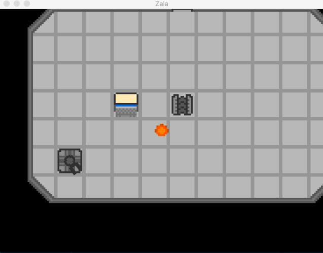

# Zala

## Building Zala

To build the project, one needs to have an up-to-date version of `rustc` and `cargo`

## CPU Spec

The [Zala Computer Processing Unit (ZPU)](docs/cpu.md) is a 32 bit, RISC-like cpu, with a simple assembly language.
The ZPU keeps your ship running in top shape, keeping up with even the largest demands in the midst of combat.

## Ship Hardware Interface

The ZPU regularly polls for interrupts, and interacts with hardware using both [ports, and MMIO](docs/hw_interface.md).

Hardware draws a base level of power when plugged in, and power use grows dynamically with hardware use, (Ex: engine running at full thrust draws significantly more power than at low)
forcing the pilot to make choices about the devices plugged in, deciding upon the devices needed most during a given situation.
(Ex: During a fight, the pilot may choose to turn lights off to make the ship harder to find,
or turn on the radar shield to make the ship invisible to other ships that might auto-probe.)

Hardware to be Implemented:
==========================
* [Lights](docs/light.md)
* Generator
* Battery
* Engine
* Weapons
* [Radar](docs/radar.md)
* Radar Shield
* Cloak
* Shield
* Life Support
* Hull Breach Detector
* Doors
* Turret

## Interface

[Interface Views](docs/gameplay.md)
